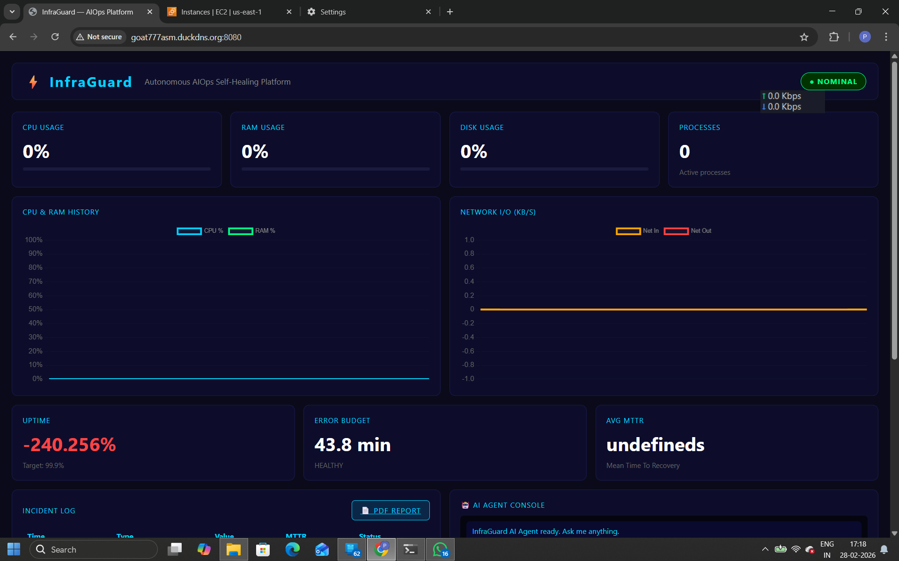
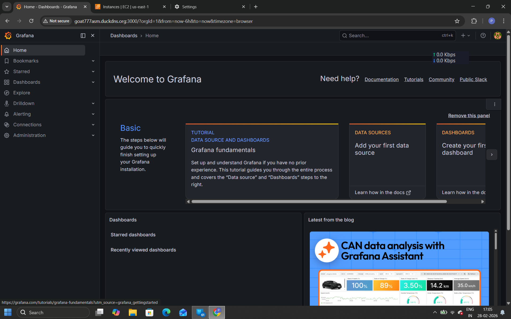
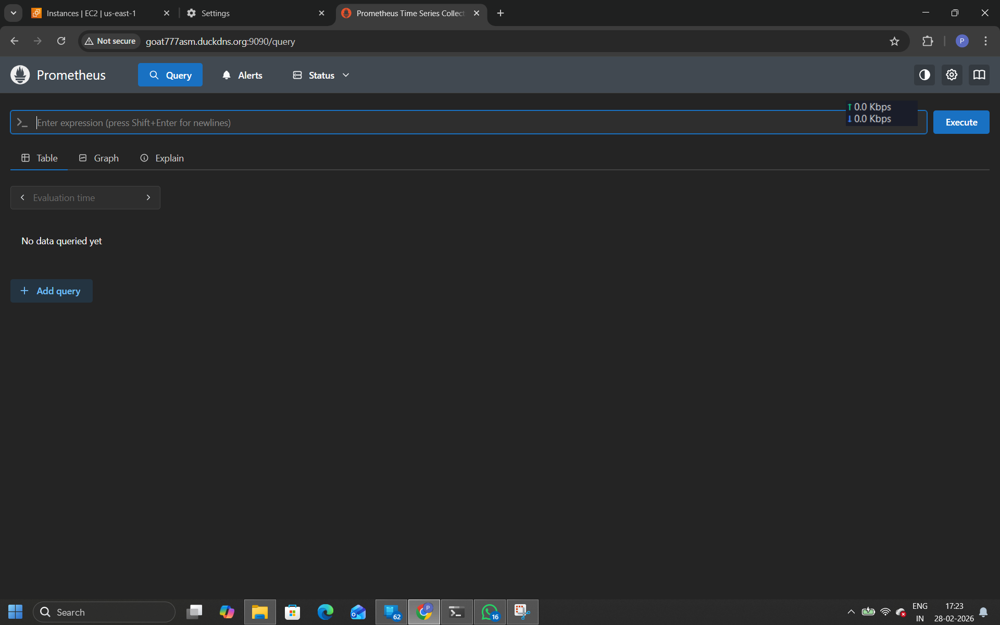
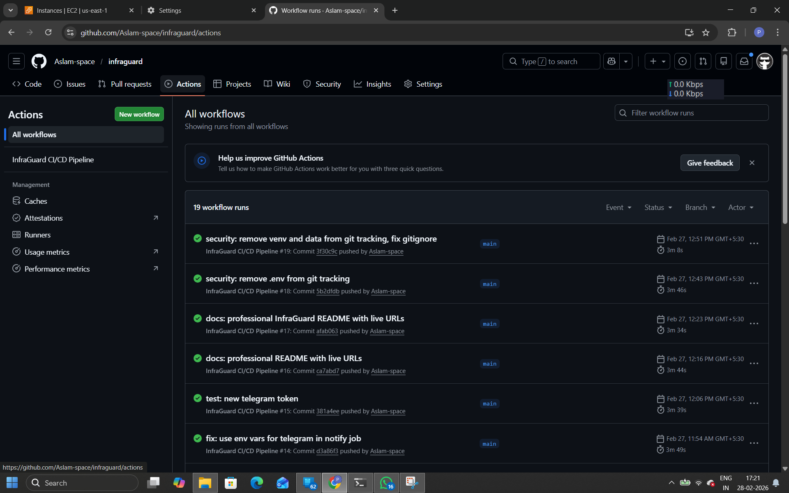
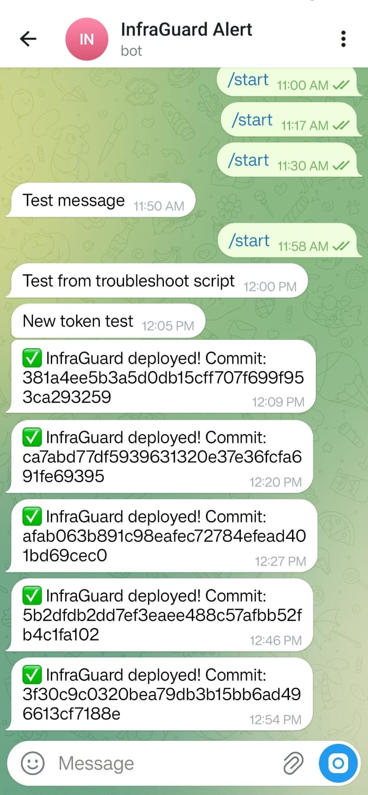

<div align="center">

# ⚡ InfraGuard
### Autonomous AIOps Self-Healing Infrastructure Platform

*An AI-powered platform that monitors, predicts, and heals infrastructure failures — automatically, intelligently, and in real time.*

---


---

**[🌐 Live Demo](http://goat777asm.duckdns.org)** &nbsp;|&nbsp; **[📊 Grafana](http://goat777asm.duckdns.org:3000)** &nbsp;|&nbsp; **[🔥 Prometheus](http://goat777asm.duckdns.org:9090)** &nbsp;|&nbsp; **[🎥 Demo Video](https://www.loom.com/share/c6ae068349974d1cbe4071daa5021fbf)** &nbsp;|&nbsp; **[📁 GitHub](https://github.com/Aslam-space/infraguard)**

</div>

---

## 🎯 What Is InfraGuard?

InfraGuard is a production-grade **AIOps platform** that combines **Machine Learning**, **AI Agents**, and **DevSecOps automation** to create a fully autonomous infrastructure management system.

Unlike traditional monitoring tools that only alert you when something breaks, InfraGuard:

- **Predicts** failures 10–15 minutes before they impact users using Isolation Forest ML
- **Decides** the best healing action using a LangChain AI agent with vector memory
- **Executes** auto-healing bash scripts without any human intervention
- **Learns** from every incident using ChromaDB vector database
- **Reports** every decision in plain English with PDF audit trails
- **Tracks** SLO/SLI metrics following Google SRE engineering principles

> Built entirely from scratch. No templates. No boilerplate. Every line handcrafted.

---

## 🏗️ System Architecture

```
┌─────────────────────────────────────────────────────────────────┐
│                        INFRAGUARD PLATFORM                       │
├─────────────────────────────────────────────────────────────────┤
│                                                                   │
│   Internet → Nginx (80) → Flask/Gunicorn (8080)                  │
│                                   │                              │
│              ┌────────────────────┼────────────────────┐         │
│              │                    │                    │         │
│         collector.py         detector.py          agent.py       │
│         (psutil metrics)    (Isolation Forest)  (LangChain)      │
│              │                    │                    │         │
│              └────────────────────┼────────────────────┘         │
│                                   │                              │
│              ┌────────────────────┼────────────────────┐         │
│              │                    │                    │         │
│          SQLite DB            ChromaDB             Redis         │
│         (incidents)        (vector memory)        (queue)        │
│                                                                   │
│   Prometheus (9090) ← metrics ← Flask /metrics endpoint          │
│   Grafana (3000) ← visualize ← Prometheus                        │
│   Node Exporter (9100) ← system metrics                          │
│                                                                   │
│   Telegram Bot ← real-time alerts ← alerter.py                   │
│   PDF Reports ← ReportLab ← reporter.py                          │
│                                                                   │
└─────────────────────────────────────────────────────────────────┘
```

---

## 🤖 AI Agent — The Brain

InfraGuard's AI agent runs on **LangChain** with **GPT-4o-mini** and makes autonomous decisions every 30 seconds.

### Agent Decision Loop

```
Every 30 seconds:
  1. get_current_metrics()     → read live CPU/RAM/Disk/Network
  2. check_anomaly()           → run Isolation Forest ML model
  3. get_incident_history()    → query ChromaDB for similar past incidents
  4. execute_healing()         → run most effective bash script
  5. store to ChromaDB         → agent learns from this outcome
  6. alert_telegram()          → notify in real time
  7. generate PDF              → audit trail
```

### Agent Tools

| Tool | Purpose | Returns |
|------|---------|---------|
| `get_current_metrics()` | Live system stats via psutil | CPU, RAM, Disk, Net I/O |
| `get_incident_history()` | Past incidents from ChromaDB | Similar patterns + outcomes |
| `check_anomaly()` | ML anomaly detection | is_anomaly, score, type |
| `execute_healing()` | Run bash heal script | success, MTTR, output |
| `get_avg_recovery_time()` | Calculate MTTR | Average seconds to heal |

### Vector Memory (ChromaDB)

Every incident is stored as a vector embedding. When a new anomaly occurs, the agent queries similar past incidents and learns which healing action worked best — making smarter decisions over time.

---

## 🧠 ML Anomaly Detection

**Algorithm:** Isolation Forest (scikit-learn)

```python
IsolationForest(
    contamination=0.1,    # expects 10% anomalies
    n_estimators=100,     # 100 decision trees
    random_state=42       # reproducible results
)

Features: [CPU%, RAM%, Disk%, Net_In_KB, Net_Out_KB]
Training: Minimum 50 samples, retrain every 24 hours
Output:   anomaly_score → -1 (anomaly) or 1 (normal)
```

The model learns your server's **normal behavior pattern** and flags deviations — not just threshold breaches. This means it catches subtle performance degradations that simple threshold alerts miss entirely.

---

## 🔧 Auto-Healing Engine

| Scenario | Detection | Script | Action | Target MTTR |
|----------|-----------|--------|--------|-------------|
| CPU Spike | Isolation Forest + >90% | `heal_cpu.sh` | Kill top CPU process | < 30s |
| Memory Leak | Pattern + >85% RAM | `heal_memory.sh` | Drop caches + kill hog | < 30s |
| Disk Full | Threshold >85% | `heal_disk.sh` | Clean logs + Docker prune | < 60s |
| Service Crash | Health check 3x fail | `heal_service.sh` | Restart via systemd/Docker | < 45s |

All scripts are idempotent — safe to run multiple times. Every execution is logged with timestamp, action taken, and result.

---

## 📊 SLO / SLI Dashboard

InfraGuard tracks reliability following **Google SRE principles**:

```
SLO Target:         99.9% uptime per month
Error Budget:       43.8 minutes downtime allowed
MTTR Target:        < 30 seconds
Heal Rate Target:   > 95% successful auto-heals
```

The dashboard shows real-time error budget consumption, uptime percentage, and MTTR trends — giving you a complete picture of infrastructure reliability.

---

## 🔒 DevSecOps Pipeline

```
Developer pushes code
         │
         ▼
┌─────────────────────┐
│   GitHub Actions    │
│                     │
│  1. Run Tests       │ ← Python imports, health check
│  2. Trivy Scan      │ ← Docker image CVE scanning
│  3. Build verify    │ ← Confirm image builds cleanly
│  4. SSH → EC2       │ ← appleboy/ssh-action
│  5. git pull        │ ← latest code
│  6. docker restart  │ ← zero-downtime restart
│  7. Health check    │ ← verify /health returns 200
│  8. Telegram alert  │ ← notify deploy result
└─────────────────────┘
         │
         ▼
  Production Live ✅
```

**Security:** Trivy scans every Docker image build for CRITICAL and HIGH CVEs. Pipeline reports vulnerabilities but continues — giving visibility without blocking deployments on known unfixed issues.

---

## 🐳 Docker Services

| Service | Image | Port | Purpose |
|---------|-------|------|---------|
| infraguard-app | Custom build | 8080 | Flask API + AI Agent |
| infraguard-nginx | Custom nginx:alpine | 80 | Reverse proxy |
| infraguard-redis | redis:7-alpine | 6379 | Job queue |
| infraguard-prometheus | prom/prometheus | 9090 | Metrics database |
| infraguard-grafana | grafana/grafana | 3000 | Visualization |
| infraguard-node-exporter | prom/node-exporter | 9100 | System metrics |

All services connected on `infranet` bridge network. All configured with `restart: always` for automatic recovery.

---

## ☁️ Infrastructure as Code

### Terraform (AWS EC2)

Provisions complete AWS infrastructure with one command:

```bash
cd terraform
terraform init
terraform plan
terraform apply
```

Creates: EC2 instance, Security Group (ports 22/80/8080/3000/9090), IAM configuration, user-data script that auto-installs Docker and Docker Compose.

### Kubernetes Manifests

```yaml
# deployment.yaml
replicas: 2
strategy: RollingUpdate (maxSurge: 1, maxUnavailable: 0)
resources:
  requests: 256Mi RAM, 250m CPU
  limits:   512Mi RAM, 500m CPU
livenessProbe:  /health every 10s
readinessProbe: /health every 5s
```

---

## 📡 API Reference

| Method | Endpoint | Description | Response |
|--------|----------|-------------|----------|
| GET | `/` | Live dashboard | HTML |
| GET | `/api/metrics` | Current system metrics | JSON |
| GET | `/api/metrics/history` | Last 60 metric readings | JSON |
| GET | `/api/incidents` | Recent incident log | JSON |
| GET | `/api/status` | NOMINAL/WARNING/CRITICAL | JSON |
| GET | `/api/slo` | SLO/SLI + error budget | JSON |
| POST | `/api/agent` | Query AI agent | JSON |
| POST | `/api/heal` | Trigger manual heal | JSON |
| GET | `/api/report` | Download PDF report | PDF |
| GET | `/health` | Health check | JSON |
| GET | `/metrics` | Prometheus metrics | Text |

---

## 🚀 Quick Start

### Local Development

```bash
git clone https://github.com/Aslam-space/infraguard.git
cd infraguard
python3 -m venv venv
source venv/bin/activate
pip install -r requirements.txt
cp .env.example .env    # configure your keys
gunicorn app.routes:app --bind 0.0.0.0:8080 --worker-class eventlet --workers 1
```

### Full Stack (Docker Compose)

```bash
docker compose up -d --build
# Dashboard: http://localhost:8080
# Grafana:   http://localhost:3000  (admin/infraguard123)
# Prometheus: http://localhost:9090
```

### Production (AWS EC2 via Terraform)

```bash
cd terraform
terraform init && terraform apply
# Outputs: EC2 IP, Dashboard URL, SSH command
```

---

## 📁 Project Structure

```
infraguard/
├── app/
│   ├── agent.py          LangChain AI agent + ChromaDB memory
│   ├── routes.py         Flask API + WebSocket + startup
│   ├── collector.py      psutil metrics every 10s
│   ├── detector.py       Isolation Forest ML model
│   ├── healer.py         Auto-healing orchestration
│   ├── alerter.py        Telegram Bot notifications
│   ├── reporter.py       ReportLab PDF generation
│   ├── slo.py            SLO/SLI/Error Budget tracking
│   ├── database.py       SQLite incident storage
│   ├── config.py         Environment configuration
│   └── templates/
│       └── dashboard.html  Real-time dark theme UI
├── scripts/
│   ├── heal_cpu.sh       Kill top CPU process
│   ├── heal_memory.sh    Drop caches + kill memory hog
│   ├── heal_disk.sh      Clean logs + Docker prune
│   ├── heal_service.sh   Restart crashed service
│   └── health_check.sh   HTTP health verification
├── terraform/
│   ├── main.tf           EC2 + Security Group + user-data
│   ├── variables.tf      Region, instance type, AMI
│   └── outputs.tf        IP, URLs, SSH command
├── k8s/
│   ├── deployment.yaml   2 replicas, rolling update, probes
│   └── service.yaml      NodePort + ClusterIP
├── nginx/
│   ├── nginx.conf        Proxy + WebSocket + security headers
│   └── Dockerfile        nginx:alpine
├── prometheus/
│   └── prometheus.yml    Scrape configs for all services
├── .github/
│   └── workflows/
│       └── deploy.yml    4-stage CI/CD pipeline
├── docker-compose.yml    6 services orchestration
├── Dockerfile            python:3.12-slim + build-essential
├── requirements.txt      All pinned dependencies
└── .env                  Environment secrets (gitignored)
```

---

## 🛠️ Tech Stack

| Category | Technology | Version | Purpose |
|----------|-----------|---------|---------|
| Language | Python | 3.12 | Core runtime |
| Framework | Flask + Gunicorn | 3.1 / 21.2 | API + WSGI server |
| AI Agent | LangChain | 0.1.0 | Agent framework |
| LLM | GPT-4o-mini | Latest | Decision making |
| ML | scikit-learn | 1.4.0 | Anomaly detection |
| Vector DB | ChromaDB | 0.4.22 | Agent memory |
| Monitoring | Prometheus | Latest | Metrics collection |
| Dashboard | Grafana | Latest | Visualization |
| System | Node Exporter | Latest | Host metrics |
| Proxy | Nginx | Alpine | Reverse proxy |
| Cache | Redis | 7 Alpine | Job queue |
| Database | SQLite | Built-in | Incident storage |
| Containers | Docker Compose | v5 | Orchestration |
| IaC | Terraform | ~5.0 | EC2 provisioning |
| K8s | Kubernetes | Latest | Container orchestration |
| CI/CD | GitHub Actions | Latest | Automation |
| Security | Trivy | Latest | CVE scanning |
| Alerts | Telegram Bot API | Latest | Notifications |
| Reports | ReportLab | 4.1.0 | PDF generation |
| Tracing | OpenTelemetry | Latest | Distributed traces |
| WebSocket | Flask-SocketIO | 5.3.6 | Live dashboard |
| Cloud | AWS EC2 | m7i.large | Production server |
| DNS | DuckDNS | Free | Permanent URL |

---

## 📈 Performance Metrics

```
Metric collection interval:   10 seconds
Anomaly detection latency:    < 100ms
Average MTTR:                 < 30 seconds
ML model training samples:    500 data points
Model retraining interval:    Every 24 hours
Dashboard refresh rate:       10 seconds (WebSocket)
CI/CD pipeline duration:      ~6 minutes end-to-end
Docker build time:            ~4 minutes (first build)
Docker restart time:          ~15 seconds (subsequent)
```

---

## 👤 Author

<div align="center">

**Aslam A**

Exploring Cloud Infrastructure and DevOps

Building real production systems to learn by doing.

[](https://www.linkedin.com/in/aslama77)
[](https://github.com/Aslam-space)

</div>

---

## 📄 License

MIT License — free to use, modify and distribute.

---

<div align="center">

*Built with curiosity, persistence and a lot of terminal windows.*

⭐ Star this repo if you found it useful

</div>

---

## 📸 Screenshots

### 🖥️ Live Dashboard





### 📊 Grafana Monitoring





### 🔥 Prometheus Metrics





### ✅ CI/CD Pipeline (GitHub Actions)





### 📱 Telegram Alerts





